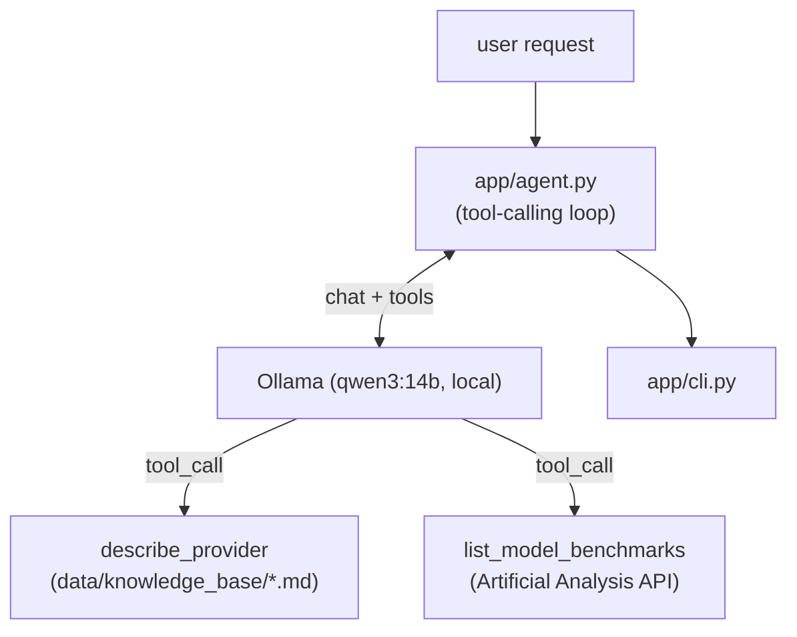

# agent_practice
[한국어](README.md) | [English](README.en.md)

An agent that recommends a commercial LLM model fitting your need (use case, budget, performance)
using live benchmark and pricing data.

## Why I built this
This started as RAG over a static local knowledge base. But recommending a model based on
"performance benchmarks" needs live data, not frozen docs, so I switched to a tool-calling agent
pattern: a local LLM (Qwen via Ollama) decides which tool to call and grounds its answer in the
result. A hands-on practice project for agentic tool use.

## Features
- Qwen (local, via Ollama — no API key needed) decides which tool to call based on the question
- `describe_provider`: qualitative overview per provider from the local knowledge base (no key needed)
- `list_model_benchmarks`: live intelligence/coding/math benchmark indices, speed, and pricing via
  the Artificial Analysis API
- CLI: one-shot recommend/question (`recommend`), interactive mode (`chat`)

## Architecture


`describe_provider` only reads local files (no key/network needed); only `list_model_benchmarks`
needs `ARTIFICIALANALYSIS_API_KEY` — without it, it returns a guidance message instead of an error,
and the agent reflects that in its answer. Design background: `aidlc-docs/inception/`.

## Getting started
```bash
python3 -m venv .venv
source .venv/bin/activate
pip install -r requirements.txt

ollama pull qwen3:14b   # one-time, pulls the local model
```
For `ARTIFICIALANALYSIS_API_KEY` (free tier), see `docs/HANDOFF.md` and run `scripts/setup_keys.py`.

## Example
```
$ python -m app.cli recommend "Recommend a model for a code-review agent, budget-conscious, cite real benchmark numbers"

### **1. Model overview and key metrics**
#### **GPT-5.6 Terra (max)**
- **Strengths**: highest artificial_analysis_intelligence_index (58.9), strong coding index (77.4)
- **Weaknesses**: expensive (30¢/M output tokens), slow time-to-first-token (86.5s)
- **Use case**: high-difficulty tasks where intelligence matters more than cost

#### **GPT-5.6 Luna (max)**
- **Strengths**: cheapest (6¢/M output tokens), fast (171 tokens/s)
- **Weaknesses**: lower intelligence index (51.2), lower coding index (71.4)
- **Use case**: budget-first tasks (simple automation, low-stakes data processing)

...(abridged — the real output includes a full comparison table and more models)...

### **5. Recommendation**
- **Budget-first**: GPT-5.6 Luna (max) — cheapest option with coding index good enough for code review
- **Performance-first**: GPT-5.6 Terra (max) — top intelligence/coding scores, higher cost
```
Abridged real output from a live run with `ARTIFICIALANALYSIS_API_KEY` set — grounded in actual
Artificial Analysis benchmark numbers. Without the key, it doesn't crash: it states plainly that
live data isn't available and falls back to a general-knowledge answer instead — both paths were
actually run and verified.

## Tech choices
- **Ollama + Qwen (local)**: no paid cloud API key needed for generation — switched from the
  original Claude API version.
- **Artificial Analysis API**: one of the few free public APIs offering intelligence/coding/math
  benchmarks and pricing for commercial LLMs in one place —
  [artificialanalysis.ai](https://artificialanalysis.ai/data-api).
- **Tool-calling instead of vector search**: since lookups are keyed by provider name, no
  embeddings/vector DB are needed — dropped Chroma/sentence-transformers, much lighter dependencies.

## Roadmap
[docs/ROADMAP.md](docs/ROADMAP.md)
