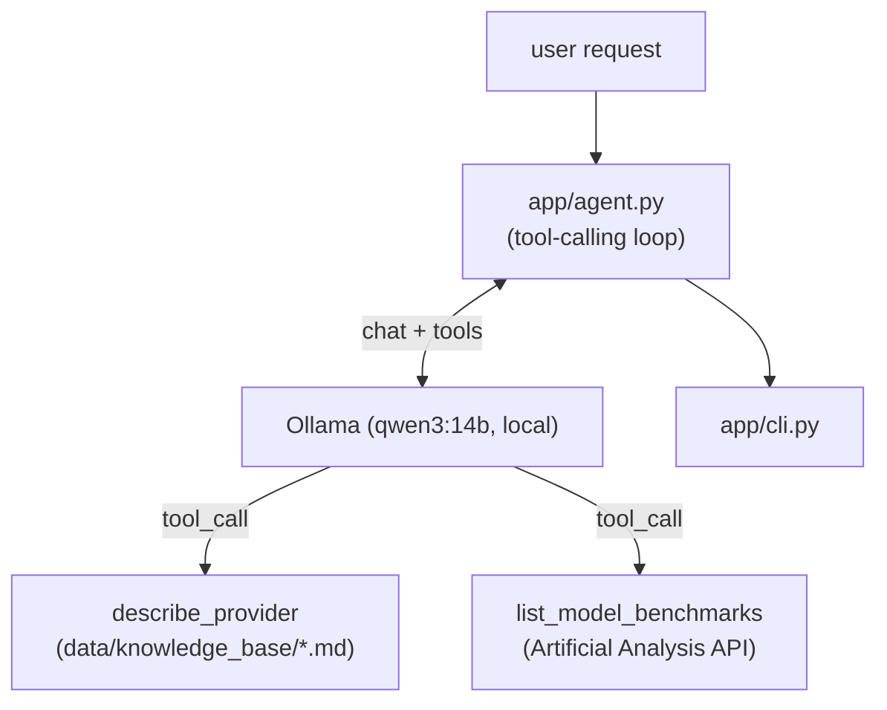

# agent_practice
[한국어](README.md) | [English](README.en.md)

An agent that recommends a commercial LLM model fitting your need (use case, budget, performance)
using live benchmark and pricing data.

## Why I built this
This started as RAG over a static local knowledge base. But recommending a model based on
"performance benchmarks" needs live data, not frozen docs, so I switched to a tool-calling agent
pattern: a local LLM (Qwen via Ollama) decides which tool to call and grounds its answer in the
result. A hands-on practice project for agentic tool use.

## Features
- Qwen (local, via Ollama — no API key needed) decides which tool to call based on the question
- `describe_provider`: qualitative overview per provider from the local knowledge base (no key needed)
- `list_model_benchmarks`: live intelligence/coding/math benchmark indices, speed, and pricing via
  the Artificial Analysis API
- CLI: one-shot recommend/question (`recommend`), interactive mode (`chat`)

## Architecture


`describe_provider` only reads local files (no key/network needed); only `list_model_benchmarks`
needs `ARTIFICIALANALYSIS_API_KEY` — without it, it returns a guidance message instead of an error,
and the agent reflects that in its answer. Design background: `aidlc-docs/inception/`.

## Getting started
```bash
python3 -m venv .venv
source .venv/bin/activate
pip install -r requirements.txt

ollama pull qwen3:14b   # one-time, pulls the local model
```
For `ARTIFICIALANALYSIS_API_KEY` (free tier), see `docs/HANDOFF.md` and run `scripts/setup_keys.py`.

## Example
```
$ python -m app.cli recommend "Recommend a model for a code-review agent, I want to save on cost"
현재 도구 사용이 불가능한 상태로, 실시간 벤치마크 데이터를 확인할 수 없습니다. 다만, 일반적으로
코드 리뷰에 적합하고 예산을 아끼는 데 유리한 모델로는 다음과 같은 선택지를 고려할 수 있습니다:
...(truncated)...
추후 도구 사용이 가능해지면, 실시간 벤치마크 점수와 가격 데이터를 기반으로 보다 정확한 추천이 가능합니다.
```
This is the actual output from a real run before `ARTIFICIALANALYSIS_API_KEY` was configured — the
missing tool is reported plainly instead of crashing, and once the key is set the agent grounds its
recommendation in real benchmark and pricing numbers.

## Tech choices
- **Ollama + Qwen (local)**: no paid cloud API key needed for generation — switched from the
  original Claude API version.
- **Artificial Analysis API**: one of the few free public APIs offering intelligence/coding/math
  benchmarks and pricing for commercial LLMs in one place —
  [artificialanalysis.ai](https://artificialanalysis.ai/data-api).
- **Tool-calling instead of vector search**: since lookups are keyed by provider name, no
  embeddings/vector DB are needed — dropped Chroma/sentence-transformers, much lighter dependencies.

## Roadmap
[docs/ROADMAP.md](docs/ROADMAP.md)
