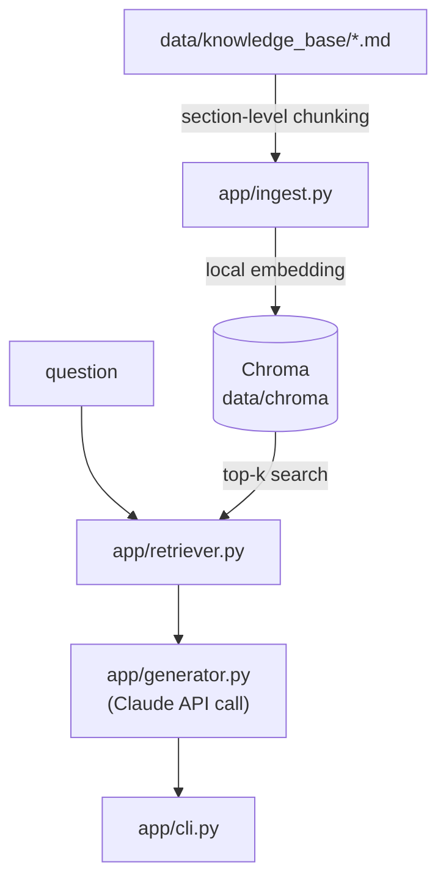

# agent_practice
[한국어](README.md) | [English](README.en.md)

A RAG agent that answers questions about commercial LLM models (Claude/GPT/Gemini/Llama/Mistral/Grok)
by searching a local knowledge base.

## Why I built this
A hands-on practice project to implement a full RAG (retrieval-augmented generation) pipeline
from scratch — chunking, embedding, vector search, prompt assembly, and LLM calls.

## Features
- Auto-chunks markdown knowledge base by `##` sections and indexes them
- Local embeddings (sentence-transformers) — indexing and retrieval work with no API key
- Calls the Claude API with retrieved evidence as context and cites sources (file/section)
- CLI: one-shot question (`ask`), interactive mode (`chat`)

## Architecture


Indexing and retrieval need no API key; only answer generation requires `ANTHROPIC_API_KEY`.
Design background: `aidlc-docs/inception/`.

## Getting started
```bash
python3 -m venv .venv
source .venv/bin/activate
pip install -r requirements.txt

python -m app.cli ingest          # index (no key needed)
```
For `ANTHROPIC_API_KEY`, see `docs/HANDOFF.md` and run `scripts/setup_keys.py`.
Optionally override the default model (`claude-opus-5`) via the `ANTHROPIC_MODEL` env var.

## Example
```
$ python -m app.cli ingest
색인 완료: 청크 42개 → /Users/vien/MyProjects/agent_practice/data/chroma

$ python -m app.cli ask "Claude Opus 5는 어떤 모델이야?"
[오류] ANTHROPIC_API_KEY가 설정되지 않았습니다. `python3 scripts/setup_keys.py` 로 입력하세요 (자세한 안내: docs/HANDOFF.md).
```
This is the actual output from a real run before a key was configured — indexing/retrieval work
correctly, and generation fails gracefully with guidance instead of crashing. Once a key is set,
`ask` returns an answer grounded in the retrieved evidence.

## Tech choices
- **Local embeddings (sentence-transformers) + Chroma**: chosen over an embedding-specific API
  (e.g. Voyage AI) so the indexing/retrieval pipeline is fully testable without any key. Only
  generation needs a Claude API key — that's the whole point of the project.
- **Chroma (local, persistent)**: no separate server needed, fits a small knowledge base.

## Roadmap
[docs/ROADMAP.md](docs/ROADMAP.md)
