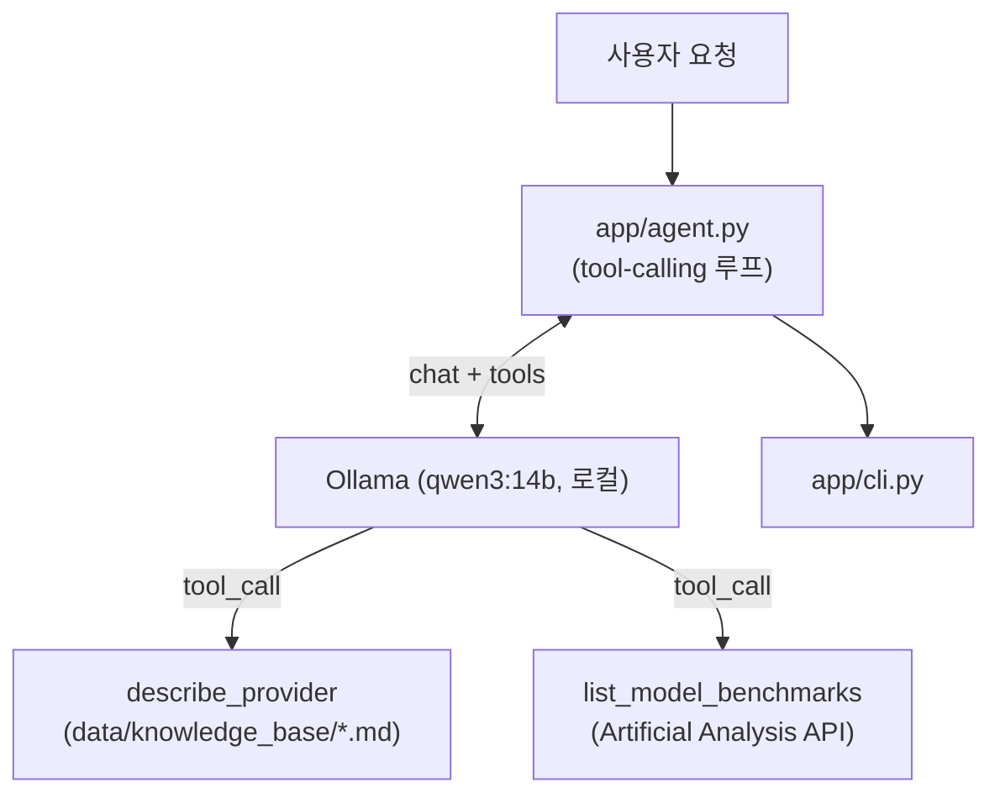

# agent_practice
[한국어](README.md) | [English](README.en.md)

사용자 요구(용도·예산·성능)에 맞는 상용 LLM 모델을 실시간 벤치마크·가격 데이터로 추천하는 에이전트.

## 왜 만들었나
처음엔 정적 지식베이스를 벡터검색하는 RAG로 시작했는데, "성능 벤치마크를 참고해서 요청에 맞는 모델을
추천"하려면 고정된 문서보다 실시간 데이터가 낫다고 판단해 tool-calling agent로 전환했다. 로컬 LLM(Qwen via
Ollama)이 필요할 때 직접 도구를 호출해 근거를 확인하고 답하는 구조를 연습하는 프로젝트.

## 주요 기능
- Qwen(Ollama 로컬 실행, 키 불필요)이 질문을 보고 어떤 도구를 부를지 스스로 판단
- `describe_provider`: 공급사별 개요·특징을 로컬 지식 저장소에서 조회 (키 불필요)
- `list_model_benchmarks`: Artificial Analysis API로 지능/코딩/수학 벤치마크 지수·속도·가격을 실시간 조회
- CLI: 1회성 추천/질문(`recommend`), 대화형(`chat`)

## 구조


`describe_provider`는 로컬 파일만 읽어 키·네트워크가 불필요하고, `list_model_benchmarks`만
`ARTIFICIALANALYSIS_API_KEY`가 필요하다 — 없으면 에러 대신 안내 메시지를 반환해 agent가 그 사실을
답변에 반영한다. 설계 배경은 `aidlc-docs/inception/`.

## 시작하기
```bash
python3 -m venv .venv
source .venv/bin/activate
pip install -r requirements.txt

ollama pull qwen3:14b   # 최초 1회, 로컬 모델 받기
```
벤치마크 조회에 필요한 `ARTIFICIALANALYSIS_API_KEY`(무료 티어)는 `docs/HANDOFF.md` 안내대로
`scripts/setup_keys.py`로 입력한다.

## 사용 예시
```
$ python -m app.cli recommend "코드 리뷰용 에이전트에 쓸 모델 추천해줘, 예산은 아끼고 싶어"
현재 도구 사용이 불가능한 상태로, 실시간 벤치마크 데이터를 확인할 수 없습니다. 다만, 일반적으로
코드 리뷰에 적합하고 예산을 아끼는 데 유리한 모델로는 다음과 같은 선택지를 고려할 수 있습니다:
...(생략)...
추후 도구 사용이 가능해지면, 실시간 벤치마크 점수와 가격 데이터를 기반으로 보다 정확한 추천이 가능합니다.
```
위는 `ARTIFICIALANALYSIS_API_KEY`를 입력하기 전 실제 실행 결과 — 도구가 없으면 에러 없이 그 사실을
답변에 명시하고, 키를 입력하면 실제 벤치마크·가격 수치를 근거로 추천한다.

## 기술 선택 (선택)
- **Ollama + Qwen(로컬)**: 생성 단계에 유료 클라우드 API 키가 필요 없도록. 초기 버전(Claude API)에서 전환.
- **Artificial Analysis API**: 상용 LLM의 지능/코딩/수학 벤치마크·가격을 한 번에 제공하는 몇 안 되는
  무료 공개 API라서 선택 — [artificialanalysis.ai](https://artificialanalysis.ai/data-api).
- **벡터검색 대신 tool-calling**: 공급사 이름으로 바로 지목해 조회하는 구조라 임베딩·벡터DB가 불필요해져
  제거(Chroma/sentence-transformers) — 의존성이 크게 가벼워짐.

## 로드맵 (선택)
[docs/ROADMAP.md](docs/ROADMAP.md)
