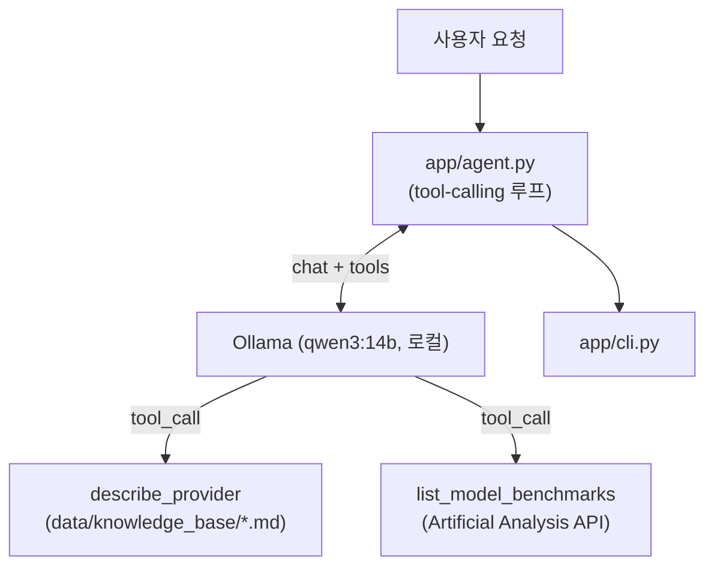

# agent_practice
[한국어](README.md) | [English](README.en.md)

사용자 요구(용도·예산·성능)에 맞는 상용 LLM 모델을 실시간 벤치마크·가격 데이터로 추천하는 에이전트.

## 왜 만들었나
처음엔 정적 지식베이스를 벡터검색하는 RAG로 시작했는데, "성능 벤치마크를 참고해서 요청에 맞는 모델을
추천"하려면 고정된 문서보다 실시간 데이터가 낫다고 판단해 tool-calling agent로 전환했다. 로컬 LLM(Qwen via
Ollama)이 필요할 때 직접 도구를 호출해 근거를 확인하고 답하는 구조를 연습하는 프로젝트.

## 주요 기능
- Qwen(Ollama 로컬 실행, 키 불필요)이 질문을 보고 어떤 도구를 부를지 스스로 판단
- `describe_provider`: 공급사별 개요·특징을 로컬 지식 저장소에서 조회 (키 불필요)
- `list_model_benchmarks`: Artificial Analysis API로 지능/코딩/수학 벤치마크 지수·속도·가격을 실시간 조회
- CLI: 1회성 추천/질문(`recommend`), 대화형(`chat`)

## 구조


`describe_provider`는 로컬 파일만 읽어 키·네트워크가 불필요하고, `list_model_benchmarks`만
`ARTIFICIALANALYSIS_API_KEY`가 필요하다 — 없으면 에러 대신 안내 메시지를 반환해 agent가 그 사실을
답변에 반영한다. 설계 배경은 `aidlc-docs/inception/`.

## 시작하기
```bash
python3 -m venv .venv
source .venv/bin/activate
pip install -r requirements.txt

ollama pull qwen3:14b   # 최초 1회, 로컬 모델 받기
```
벤치마크 조회에 필요한 `ARTIFICIALANALYSIS_API_KEY`(무료 티어)는 `docs/HANDOFF.md` 안내대로
`scripts/setup_keys.py`로 입력한다.

## 사용 예시
```
$ python -m app.cli recommend "코드 리뷰 에이전트용 모델 추천, 예산 아끼고 싶어. 벤치마크 수치로 근거 대."

### **1. 모델 개요와 핵심 지표**
#### **GPT-5.6 Terra (max)**
- **강점**: 가장 높은 artificial_analysis_intelligence_index(58.9), 강한 coding index(77.4)
- **약점**: 높은 비용(출력 백만 토큰당 30¢), 느린 time-to-first-token(86.5초)
- **용도**: 비용보다 지능이 중요한 고난도 작업

#### **GPT-5.6 Luna (max)**
- **강점**: 가장 저렴함(출력 백만 토큰당 6¢), 빠른 속도(초당 171토큰)
- **약점**: 상대적으로 낮은 intelligence index(51.2), coding index(71.4)
- **용도**: 예산 중심 작업(단순 자동화, 저위험 데이터 처리)

...(중략, 전체 비교표·추천 근거는 실제 출력에 포함)...

### **5. 추천**
- **예산 우선**: GPT-5.6 Luna (max) — 가장 저렴하면서 코드 리뷰에 충분한 coding index 보유
- **성능 우선**: GPT-5.6 Terra (max) — 최고 지능·코딩 지수, 비용은 더 높음
```
`ARTIFICIALANALYSIS_API_KEY` 설정 후 실제 라이브 실행 결과(축약) — 실제 Artificial Analysis 벤치마크
수치를 근거로 추천한다. 키가 없으면 에러로 죽는 대신 "실시간 데이터를 확인할 수 없다"고 명시하고
일반 지식 기반의 잠정 답변으로 대체한다 — 두 경우 다 실제로 실행해서 확인했다.

## 기술 선택 (선택)
- **Ollama + Qwen(로컬)**: 생성 단계에 유료 클라우드 API 키가 필요 없도록. 초기 버전(Claude API)에서 전환.
- **Artificial Analysis API**: 상용 LLM의 지능/코딩/수학 벤치마크·가격을 한 번에 제공하는 몇 안 되는
  무료 공개 API라서 선택 — [artificialanalysis.ai](https://artificialanalysis.ai/data-api).
- **벡터검색 대신 tool-calling**: 공급사 이름으로 바로 지목해 조회하는 구조라 임베딩·벡터DB가 불필요해져
  제거(Chroma/sentence-transformers) — 의존성이 크게 가벼워짐.

## 로드맵 (선택)
[docs/ROADMAP.md](docs/ROADMAP.md)
