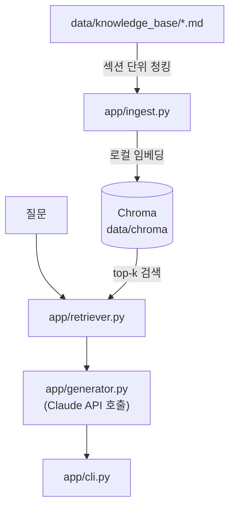

# agent_practice
[한국어](README.md) | [English](README.en.md)

상용 LLM 모델(Claude/GPT/Gemini/Llama/Mistral/Grok) 정보를 검색해 질문에 답하는 RAG 에이전트.

## 왜 만들었나
RAG(검색 증강 생성) 파이프라인을 처음부터 끝까지 직접 손으로 구현해보는 연습 프로젝트.
청킹·임베딩·벡터검색·프롬프트 조합·LLM 호출을 각각 어떻게 엮는지 감을 잡는 게 목적.

## 주요 기능
- 마크다운 지식 저장소를 `##` 섹션 단위로 자동 청킹 후 색인
- 로컬 임베딩(sentence-transformers)으로 별도 API 키 없이 색인·검색 가능
- 검색된 근거를 컨텍스트로 Claude API를 호출해 출처(파일명/섹션)와 함께 답변
- CLI: 1회성 질문(`ask`), 대화형(`chat`)

## 구조


색인(ingest)·검색(retriever)은 키가 필요 없고, 답변 생성(generator) 단계에서만 `ANTHROPIC_API_KEY`가 필요하다.
설계 배경은 `aidlc-docs/inception/`.

## 시작하기
```bash
python3 -m venv .venv
source .venv/bin/activate
pip install -r requirements.txt

python -m app.cli ingest          # 색인 (키 불필요)
```
답변 생성에 필요한 `ANTHROPIC_API_KEY`는 `docs/HANDOFF.md` 안내대로 `scripts/setup_keys.py`로 입력한다.
선택적으로 `ANTHROPIC_MODEL` 환경변수로 기본 모델(`claude-opus-5`)을 바꿀 수 있다.

## 사용 예시
```
$ python -m app.cli ingest
색인 완료: 청크 42개 → /Users/vien/MyProjects/agent_practice/data/chroma

$ python -m app.cli ask "Claude Opus 5는 어떤 모델이야?"
[오류] ANTHROPIC_API_KEY가 설정되지 않았습니다. `python3 scripts/setup_keys.py` 로 입력하세요 (자세한 안내: docs/HANDOFF.md).
```
위는 키를 입력하기 전 실제 실행 결과 — 색인/검색은 정상 동작하고, 생성 단계에서만 키를 요구하며 에러로 죽지 않고 안내 후 종료한다.
키를 입력하면 `ask`가 검색된 근거를 인용한 답변을 출력한다.

## 기술 선택 (선택)
- **로컬 임베딩(sentence-transformers) + Chroma**: Voyage AI 등 임베딩 전용 API 대신 선택 — 연습 프로젝트에서
  색인·검색 파이프라인을 키 없이 완전히 테스트 가능하게 하기 위함. 생성 단계만 Claude API 키가 필요(이 프로젝트의 본질).
- **Chroma(로컬 persistent)**: 별도 서버 없이 소규모 지식저장소에 적합.

## 로드맵 (선택)
[docs/ROADMAP.md](docs/ROADMAP.md)
